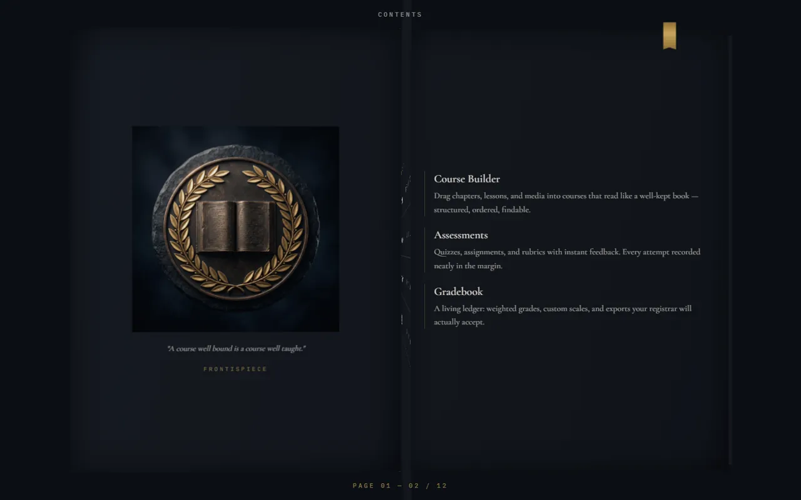
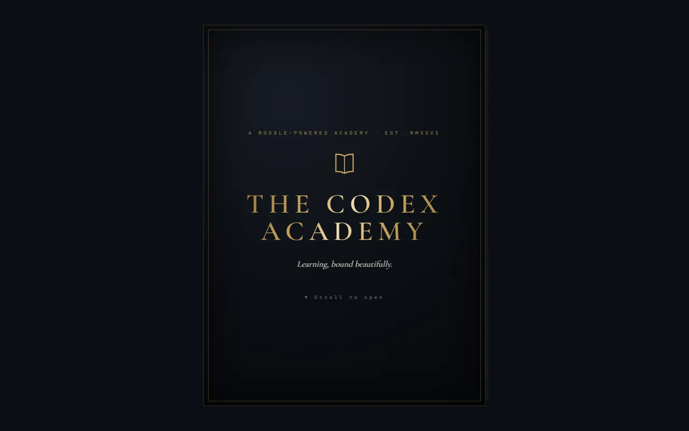

# cinematic-scroll-landing

A **Claude Code skill** for building dark, cinematic, awwwards-style landing
pages with seamless scroll choreography — plus its living proof: **The Codex
Academy**, a landing page where the entire site is a book whose pages turn as
you scroll.

**Live demo:** https://codex-academy-five.vercel.app



## What's in here

| Path | What it is |
|---|---|
| `SKILL.md` | The skill: core system, set-piece menu with honest costs, workflow, hard-won gotchas |
| `references/book-mode.md` | Full-page book sites: the sheet model, z-index choreography, timeline math, flat fallback |
| `references/motion-recipes.md` | GSAP/Lenis recipes: infinite loop, morph gallery, flip-book, dissolves, marquee, preloader |
| `references/imagery-universe.md` | One-visual-universe AI imagery: locked style template, generation ops, contact-sheet QA, ship-size discipline |
| `references/verification-harness.md` | Visual verification when browser tooling misbehaves: puppeteer-core harness, Lighthouse guidance |
| `scripts/audit_images.py` | Audits image refs vs `public/` (missing, unused, shared-generic wiring smells) |
| `demo/` | The Codex Academy — React 19 + Vite + Tailwind + GSAP ScrollTrigger + Lenis, built with the skill |
| `docs/superpowers/` | The full paper trail: design spec, 14-task implementation plan, retrospective |

## The demo in one paragraph

One 100vh sticky stage and a single scrubbed GSAP timeline turn CSS-3D
sheets around a spine — cover opens, five spreads flip, the book ends open
on the CTA (~8 viewports of scroll). Each sheet's front is right-page k and
its back is left-page k+1, with choreographed z-indexes so a turning page
passes *above* already-turned ones. Mobile and `prefers-reduced-motion` get
the identical DOM reflowed into stacked sections (`display: contents` +
flex `order`). All imagery was generated from one locked style template and
shipped as 676KB of WebP. Lighthouse: accessibility 100, CLS 0.



## Requirements

Installing the skill needs nothing but the copy commands below — skills are
passive documents, so there is no setup step and nothing to configure up
front. Each requirement matters only when its workflow step arrives:

- **Node 20+** — building the demo or any site made with the skill
- **Python 3** (stdlib only) — `scripts/audit_images.py` and the setup
  checker; Pillow optional (contact sheets, watermark crops)
- **An image-generation tool + key** — only when generating imagery; any
  image-gen MCP/skill works, and Google AI keys are free at
  [aistudio.google.com/apikey](https://aistudio.google.com/apikey)
- **Installed Chrome** — the visual-verification harness drives it via
  puppeteer-core
- **Deploy auth of your choice** (`npx vercel login`, `gh auth login`) —
  only at deploy time

On first use, run `python scripts/check_setup.py` for a gap report; the
skill instructs the agent to walk you through closing any gaps, with your
approval, at the moment each one is actually needed.

## Using the skill (Claude Code)

Copy the skill files into your skills directory:

```bash
mkdir -p ~/.claude/skills/cinematic-scroll-landing/references ~/.claude/skills/cinematic-scroll-landing/scripts
cp SKILL.md ~/.claude/skills/cinematic-scroll-landing/
cp references/*.md ~/.claude/skills/cinematic-scroll-landing/references/
cp scripts/*.py ~/.claude/skills/cinematic-scroll-landing/scripts/
```

It triggers on requests like "book landing page", "flipbook site",
"endless scroll", "cinematic landing page", or complaints that a scroll
experience "feels disjointed".

## Running the demo

```bash
cd demo
npm install
npm run dev        # develop
npx vitest run     # 11 tests: timeline math + content wiring
npm run build && npm run preview
```

Dev harnesses (drive the installed Chrome via puppeteer-core):
`node shoot.mjs <url> <outdir>` screenshots exact scroll depths;
`node console-check.mjs <url>` sweeps the full scroll for errors.

## Provenance & disclaimers

- Original skill drafted by a kimi-3-swarm run; reviewed, restructured, and
  battle-tested against this build (the original is preserved as the repo's
  baseline commit).
- The Codex Academy is a **fictional demonstration**: every institution,
  person, and statistic is invented; the CTA is intentionally inert and no
  data is collected. "Powered by Moodle™" is a nominative reference to the
  open-source LMS; this project is not affiliated with or endorsed by Moodle.
- Demo imagery was AI-generated (Gemini) from a locked style template.

## License

MIT — see [LICENSE](LICENSE).
